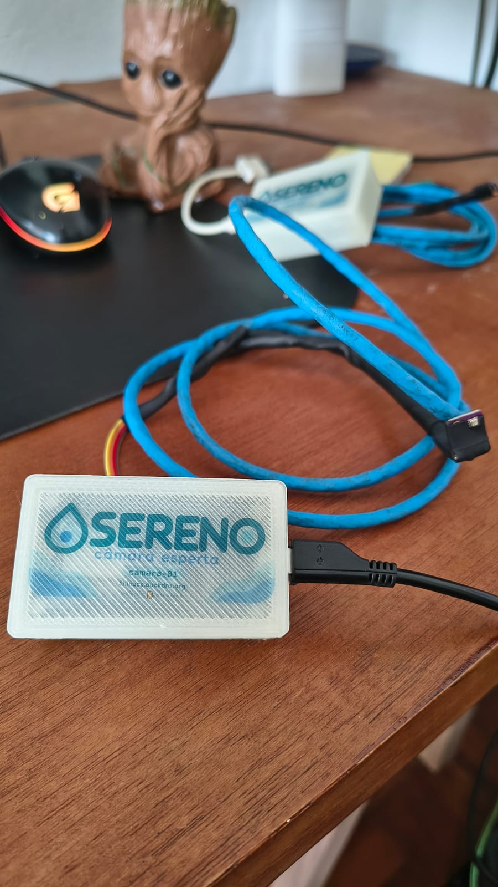
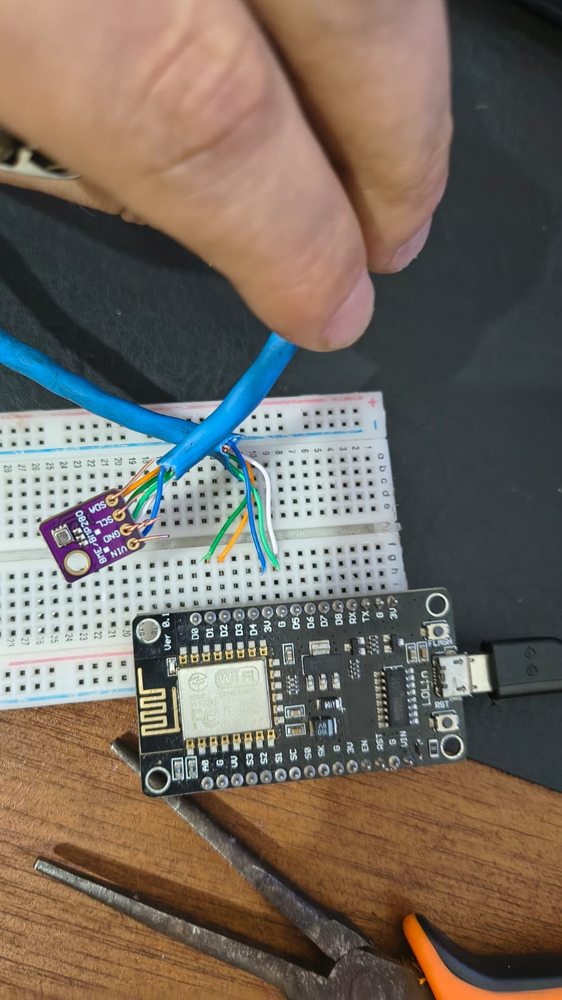
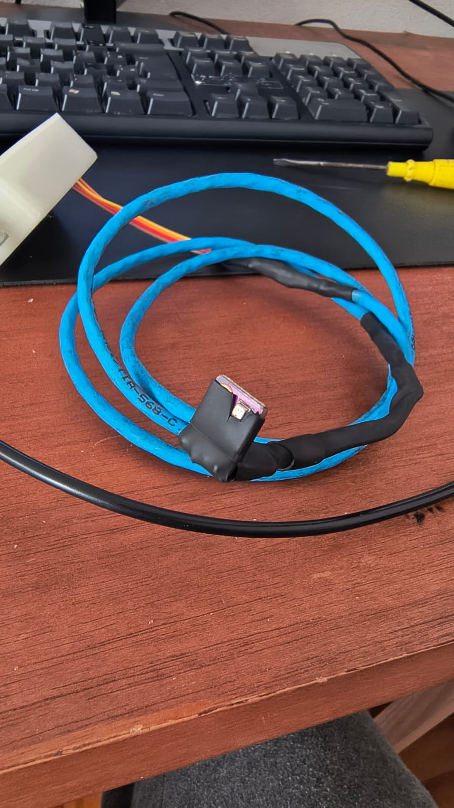

# SERENO

**câmara esperta**

Monitoramento de câmaras frias com ESP8266, BME280, PHP, SQLite e um dashboard web.

O SERENO existe para acompanhar temperatura, umidade e pressão sem depender de uma conferência manual o tempo todo. Um ESP8266 lê o sensor BME280 e envia os dados periodicamente para o servidor, que registra o histórico e disponibiliza tudo no navegador.

Enquanto as leituras chegam, o Alert Engine observa os limites de temperatura e o estado de cada dispositivo. Se algo sai do esperado — ou se uma câmara deixa de responder — o sistema registra a mudança como um evento.

<p align="center">
  
</p>

O projeto nasceu para uso real, mas continua sendo pessoal e experimental: pequeno o bastante para ser entendido por inteiro e aberto para quem quiser explorar, adaptar ou simplesmente acompanhar a construção.

## O que ele faz

- Mede temperatura, umidade e pressão.
- Mantém histórico das leituras no SQLite.
- Trabalha com múltiplas câmaras e dispositivos.
- Permite configurar limites de temperatura por dispositivo.
- Usa tolerância e histerese para evitar alertas precipitados.
- Registra eventos de temperatura alta, baixa e normalização.
- Detecta quando um dispositivo fica offline e quando volta a enviar.
- Reúne eventos em uma central de notificações no dashboard.
- Protege alterações administrativas com login e CSRF.
- Oferece um dashboard responsivo para computador e celular.

## Como funciona

```text
BME280
   │  I²C
   ▼
ESP8266
   │  HTTPS / JSON
   ▼
API PHP ─────────────┐
   │                  │
   ▼                  ▼
SQLite ◄── Alert Engine
   │                  ▲
   ├── Dashboard       │
   └── monitor.php ───┘
          cron
```

- O **BME280** fornece as três medições ambientais.
- O **ESP8266** monta o payload JSON e envia uma leitura por vez para `api.php`.
- A **API PHP** valida o dispositivo e os valores recebidos antes de gravá-los.
- O **SQLite** guarda dispositivos, leituras, estados, eventos e notificações lidas.
- O **Alert Engine** acompanha temperatura, tolerância, histerese e mudanças de estado.
- O **dashboard** consulta a API para apresentar os dados e as configurações.
- O **monitor.php**, executado periodicamente, identifica dispositivos que pararam de enviar.

## Hardware e montagem

O dispositivo usa poucos componentes:

- ESP8266 em uma placa NodeMCU;
- sensor BME280;
- alimentação USB;
- comunicação I²C;
- cabo CAT5 na montagem do sensor.

O firmware inicializa o BME280 no endereço I²C `0x76` com esta pinagem:

| BME280 | ESP8266 |
| --- | --- |
| VCC | 3V3 |
| GND | GND |
| SDA | D2 / GPIO4 |
| SCL | D1 / GPIO5 |

<table>
  <tr>
    <td align="center" width="50%">
      <br>
      <sub>O ESP8266 e o BME280 na fase de prototipagem.</sub>
    </td>
    <td align="center" width="50%">
      <br>
      <sub>Sensor e cabeamento preparados para a montagem física.</sub>
    </td>
  </tr>
</table>

O caminho foi direto: primeiro a protoboard, depois o cabeamento do sensor e, por fim, a eletrônica acomodada em uma caixa com a identidade do SERENO.

## Dashboard

O dashboard concentra o estado atual e o histórico de cada câmara. Nele aparecem:

- estado operacional do dispositivo;
- horário da última leitura;
- temperatura, umidade e pressão atuais;
- gráfico de 1 hora, 6 horas, 24 horas ou 7 dias;
- leituras recentes;
- eventos do Alert Engine;
- central de notificações;
- configurações de limites e monitoramento.

<!-- screenshot do dashboard aqui -->

As consultas e a visualização são públicas no comportamento atual. Ações que alteram configurações ou o estado compartilhado das notificações pedem autenticação administrativa.

## Alert Engine

O Alert Engine tenta separar uma oscilação breve de um problema que realmente merece atenção.

Cada dispositivo tem limites mínimo e máximo de temperatura. Quando uma leitura cruza um desses limites, a condição fica pendente durante o tempo de tolerância configurado. Se ela continuar, o estado passa a `TEMP_ALTA` ou `TEMP_BAIXA`.

A histerese cria uma pequena margem para o retorno ao normal. Assim, uma temperatura oscilando exatamente sobre o limite não fica alternando o estado a cada leitura. Quando a medição volta para a faixa segura, o dispositivo retorna a `NORMAL`.

Se as leituras param de chegar, o monitor periódico muda o estado para `OFFLINE`. A próxima leitura válida registra o retorno `ONLINE`.

Os estados internos são `NORMAL`, `TEMP_ALTA`, `TEMP_BAIXA` e `OFFLINE`. As transições geram eventos como `TEMP_HIGH`, `TEMP_LOW`, `NORMALIZED`, `OFFLINE` e `ONLINE`.

## Estrutura do projeto

| Caminho | Papel |
| --- | --- |
| `esp/` | Firmware Arduino e exemplo de configuração privada do dispositivo |
| `src/` | Banco, dispositivos, autenticação, persistência e regras do Alert Engine |
| `scripts/` | Inicialização do banco, cadastro de dispositivo e migração legada |
| `tests/` | Testes PHP com bancos temporários ou em memória |
| `data/` | SQLite e arquivos de runtime locais, fora do versionamento |
| `imgs/` | Fotos da construção e do dispositivo pronto |
| `api.php` | Ingestão das leituras e endpoints usados pelo dashboard |
| `index.php` | Interface web do SERENO |
| `monitor.php` | Verificação de dispositivos offline por CLI/cron |

## Instalação

### Servidor

Requisitos:

- PHP com PDO SQLite;
- servidor web;
- HTTPS;
- cron ou tarefa agendada para `monitor.php`.

Crie a configuração local a partir do exemplo:

```bash
cp .env.example .env
```

Preencha o `.env` somente no servidor. Ele define o caminho do SQLite, o dispositivo padrão, o hash administrativo e os tokens individuais dos dispositivos.

Crie um banco vazio com o schema atual:

```bash
php scripts/init_db.php
```

O comando cria `data/camara.sqlite`, sem dispositivos, leituras ou eventos. O diretório `data/` precisa ser gravável pelo usuário do PHP para que o SQLite também possa criar seus arquivos auxiliares.

Para cadastrar o primeiro dispositivo, crie temporariamente um JSON com sua configuração:

```json
{
  "nome": "Câmara 1",
  "habilitado": true,
  "temperatura_min": 1,
  "temperatura_max": 8,
  "tolerancia_minutos": 5,
  "offline_minutos": 5,
  "histerese_temperatura": 0.5,
  "monitoramentos": {
    "temperatura": true,
    "offline": true
  }
}
```

Depois execute:

```bash
php scripts/add_device.php camara-01 dispositivo.json
```

O identificador usado aqui deve corresponder ao `DEVICE_ID` do ESP. Para autenticar a ingestão, configure o token equivalente no `.env`, seguindo o formato `DEVICE_CAMARA_01_TOKEN`, e o mesmo valor no arquivo privado do firmware.

### ESP8266

Copie o exemplo de configuração:

```bash
cp esp/config.example.h esp/config.h
```

No `esp/config.h` privado, configure:

- `DEVICE_ID`: identificador cadastrado no servidor;
- `DEVICE_TOKEN`: token correspondente no `.env`;
- `API_URL`: endereço HTTPS completo de `api.php`;
- `WIFI_SSID_1` e `WIFI_PASSWORD_1`: rede principal;
- `WIFI_SSID_2` e `WIFI_PASSWORD_2`: rede reserva;
- `SEND_INTERVAL_MS`: intervalo entre os envios.

O sketch atual usa os nomes com sufixos `_1` e `_2` para as duas redes. Ao preparar o arquivo privado a partir do exemplo, ajuste as definições de Wi-Fi para esses nomes.

Bibliotecas usadas pelo firmware:

- ESP8266WiFi, WiFiClientSecure e ESP8266HTTPClient, fornecidas pelo core Arduino para ESP8266;
- Wire;
- Adafruit Unified Sensor;
- Adafruit BME280 Library.

Com as bibliotecas instaladas, abra `esp/esp.ino`, selecione a placa ESP8266 correspondente e envie o sketch. `esp/config.h` contém credenciais locais e não deve ser versionado.

## Administração

O dashboard e os endpoints de leitura são públicos. As operações de escrita do painel exigem uma sessão administrativa e um token CSRF válido.

A senha não fica gravada no código. O servidor recebe `ADMIN_PASSWORD_HASH` pelo `.env` e valida o login com `password_verify()`.

Para gerar o hash, execute:

```bash
php -r "echo password_hash(trim(fgets(STDIN)), PASSWORD_DEFAULT), PHP_EOL;"
```

Digite a senha quando o comando aguardar a entrada e copie apenas o hash resultante para o `.env`.

## Detecção de offline

O ESP pode simplesmente parar de enviar: falta de energia, Wi-Fi indisponível ou uma falha no dispositivo não produzem uma requisição para avisar o servidor.

Por isso, `monitor.php` consulta periodicamente a última leitura de cada câmara. Quando o tempo configurado é ultrapassado, ele registra o estado `OFFLINE` e o evento correspondente. O script aceita apenas execução por CLI.

Exemplo de cron a cada minuto:

```cron
* * * * * /usr/bin/php /caminho/sereno/monitor.php
```

## Segurança

- `.env` guarda configurações e hashes privados e não deve entrar no Git.
- `esp/config.h` guarda Wi-Fi, endpoint e token do dispositivo e também deve permanecer privado.
- Cada dispositivo pode enviar seu `DEVICE_TOKEN` pelo cabeçalho `X-Device-Token`.
- A senha administrativa é armazenada como hash, não em texto puro.
- O diretório `data/` precisa ser bloqueado para acesso HTTP. O projeto inclui proteção para Apache em `data/.htaccess`; outros servidores exigem regra equivalente.
- A comunicação com a API deve usar HTTPS.

## Testes

Os testes usam SQLite em memória ou arquivos temporários e não acessam o banco operacional:

```bash
php tests/init_db_test.php
php tests/alert_engine_test.php
php tests/panel_notifications_test.php
php tests/sqlite_migration_test.php
php tests/monitor_sqlite_test.php
php tests/api_sqlite_test.php
php tests/admin_auth_test.php
```

Para verificar a sintaxe de todos os arquivos PHP:

```bash
php -l api.php
php -l index.php
php -l monitor.php
```

## Instalações antigas e migração

As primeiras versões do SERENO armazenavam dispositivos, leituras, estados e eventos em JSON. O comando abaixo existe para importar esses arquivos legados para o schema SQLite atual:

```bash
php scripts/migrate_sqlite.php
```

Instalações novas devem usar `scripts/init_db.php`; a migração é necessária apenas para preservar dados de uma instalação antiga.

## Limitações conhecidas

- A integração com Telegram ainda não foi implementada.
- O firmware usa atualmente `setInsecure()` na conexão HTTPS e, portanto, não valida o certificado apresentado pelo servidor.
- A detecção de dispositivos offline depende da execução periódica de `monitor.php`.
- Dashboard, telemetria, eventos e configurações de leitura são públicos; somente as operações administrativas de escrita exigem login.
- Novos dispositivos são cadastrados por CLI; o dashboard edita dispositivos existentes, mas não cria nem remove cadastros.

## Sobre o projeto

O SERENO nasceu de uma necessidade bem concreta: enxergar o que está acontecendo dentro de uma câmara fria antes que o problema seja percebido tarde demais.

Ele foi tomando forma entre protoboard, fios, leituras reais e pequenos ajustes no uso diário. O resultado é este projeto: um aparelho físico de verdade, com um backend simples e código suficiente para medir, guardar e contar a história do ambiente que acompanha.
